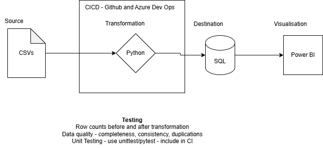
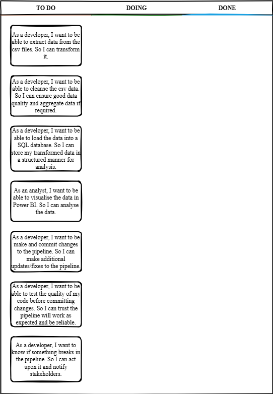

# DEModule5Library
For Module 5 of the Data Engineering apprenticeship. Library exercise.
## Architecture Diagram

## Kanban Board

## Problem
A library is looking to improve their current quality analysis.
They currently manually complete this task but this is taking too much time and is not a reliable or scalable solution.

They want a more efficient and reliable solution to cleanse and filter their data using Python.

## Proposed Solution
A pipeline using a python script to automatically extract the data from their csv locations, cleanse the data, such as remove duplicates and fix data formats, and then load the cleansed data in a SQL database.
A Power BI report will then be built, using this SQL data, to visualise the loan and customer data, and metrics about the pipeline runs.

The solution will be packaged as a Docker image to create a consistent, portable and resuable environment for running the solution.